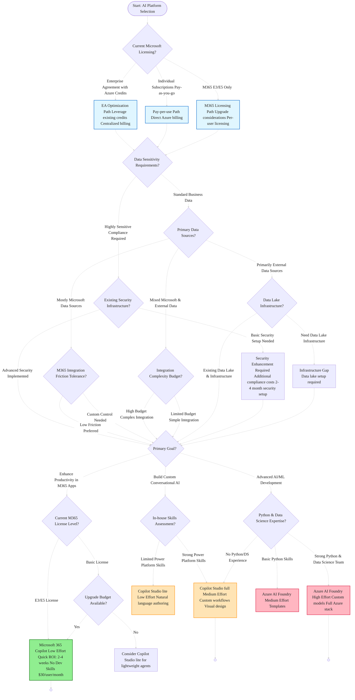
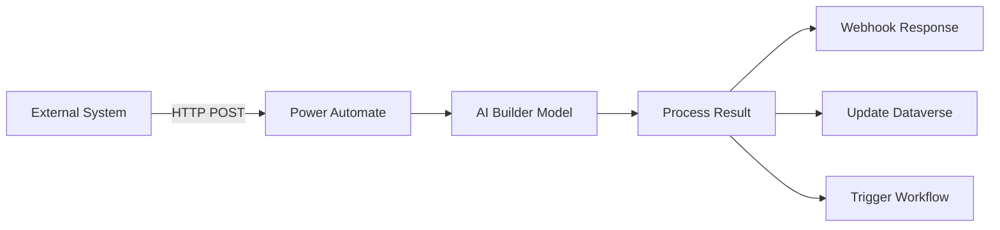
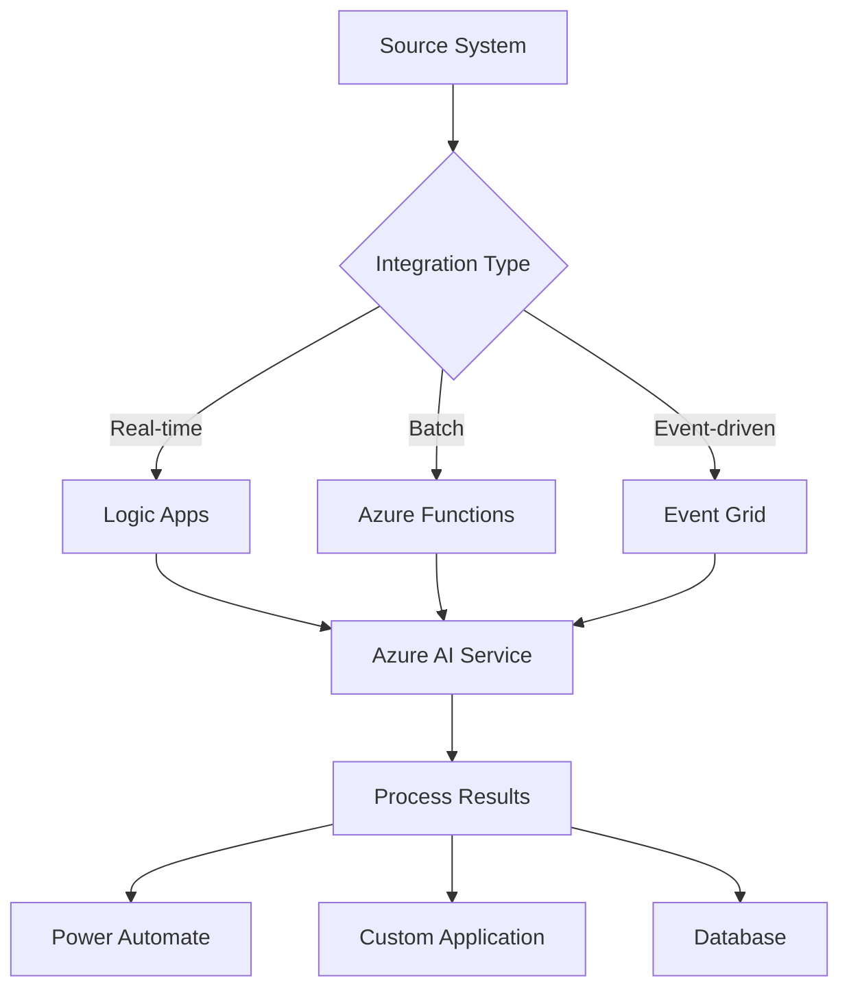

# Microsoft AI Platform Decision Framework

This visual decision framework helps organizations choose the right Microsoft AI platform based on their specific requirements, constraints, and objectives. The framework considers implementation effort, developer skill requirements, and timeline constraints.

## Decision Framework Overview

The decision process evaluates six primary Microsoft AI platforms:
- **Microsoft 365 Copilot**: AI embedded in productivity applications for enhanced user workflows
- **Copilot Studio (lite)**: Lightweight declarative agents built within Microsoft 365 Copilot for individuals and small teams using natural language authoring. These agents use the same scalable infrastructure as Microsoft 365 Copilot but are scoped to meet specific business needs
- **Copilot Studio (full)**: Comprehensive conversational AI platform for custom agents with complex workflows, multi-step logic, and enterprise governance
- **Azure AI Foundry**: Advanced AI development platform with comprehensive AI services (Document Intelligence, Vision, Speech, Language, Custom Models)
- **Microsoft AI Builder**: No-code AI capabilities integrated with Power Platform for business process automation
- **Power Platform**: Business process automation and app development with integrated AI Builder capabilities

## Visual Decision Tree


| Platform | User Type | Authoring Model | Code Level |
|----------|------------------|---------------------|-------------------|
| **Microsoft 365 Copilot** | 🟢 End-user training only | 🟢 Configuration-based | 🟢 Low-Code |
| **Copilot Studio lite** | 🟢 Information workers | 🟢 Natural language authoring | 🟢 Low-Code |
| **Copilot Studio full** | 🟡 Makers and developers | 🟡 Visual programming | 🟡 Low/Pro-Code |
| **Azure AI Foundry** | 🔴 Professional developer | 🔴 AI/ML programming | 🔴 Pro-Code |
| **Microsoft AI Builder** | 🟢 Business user | 🟢 Point-and-click setup | 🟢 Low-Code |
| **Power Platform** | 🟡 Business analyst | 🟡 Process design | 🟡 Low/Pro-Code |

**Note**: GitHub Copilot can be utilized to supplement all development efforts across these platforms, accelerating code generation, debugging, and best practice implementation regardless of skill level.

### Cost Considerations (Per-License Pricing)
| Platform | Primary Licensing Model | Per-User Cost | Credit/Usage Model | Key Cost Factors |
|----------|------------------------|---------------|-------------------|------------------|
| **Microsoft 365 Copilot** | User-based subscription | $30/user/month | N/A | Requires M365 E3/E5 base license |
| **Copilot Studio lite** | Included with M365 Copilot | Included in $30/user | Free for web knowledge agents | Included with Copilot license or pay-as-you-go |
| **Copilot Studio full** | Pay-as-you-go or monthly plan | N/A | $0.01/credit (Azure billing) or $200/month for 25,000 credits | Usage varies by conversation complexity |
| **Azure AI Foundry** | Pay-per-use consumption | N/A | Varies by model and tokens | GPT-4: ~$0.03/1K tokens, Custom models vary |
| **Microsoft AI Builder** | User-based subscription | $40/user/month | 5,000 credits included | Additional credits $0.01 each |
| **Power Platform** | User/App-based subscription | $20-40/user/month | Varies by plan | Dataverse storage and API calls additional |

## Enterprise Decision Factors Deep Dive

### Licensing & Budget Strategy Analysis

#### Enterprise Agreement vs. Pay-as-You-Go Considerations

| Factor | Enterprise Agreement (EA) | Pay-as-You-Go | Hybrid Approach |
|--------|---------------------------|----------------|-----------------|
| **Cost Predictability** | 🟢 Fixed annual commitment | � Variable monthly costs | 🟡 Mixed predictability |
| **Azure Credits** | 🟢 Bulk credits available | � Individual subscription billing | 🟡 Strategic credit allocation |
| **Billing Complexity** | 🟢 Centralized true-up | 🟡 Direct Azure billing | � Multiple billing streams |
| **Cost Optimization** | 🟢 Reserved instance discounts | � On-demand pricing | 🟡 Selective optimization |
| **Budget Control** | 🟡 Annual commitment structure | 🟢 Direct usage control | 🟢 Flexible allocation |

**Recommendation Matrix**:
- **Choose EA Path** for: High annual Azure spend, predictable usage, centralized IT budget
- **Choose Pay-as-You-Go** for: Variable usage patterns, departmental budgets, flexible scaling needs
- **Choose Hybrid** for: Mixed usage patterns, some predictable workloads

#### Existing License Optimization Opportunities

| Current License State | M365 Copilot Path | Copilot Studio Path | Azure AI Foundry Path |
|----------------------|-------------------|-------------------|---------------------|
| **M365 E5 + Azure EA** | ✅ Optimal - Included | ✅ Good - Use EA credits | ✅ Excellent - Full EA benefits |
| **M365 E3 + Azure EA** | 🟡 Upgrade to E5 needed | ✅ Good - Use EA credits | ✅ Excellent - Full EA benefits |
| **M365 E5 + Pay-per-use** | ✅ Optimal - No Azure needed | 🟡 Direct Azure billing | � Direct Azure billing |
| **M365 E3 + Pay-per-use** | � Requires E5 upgrade | 🟡 Direct Azure billing | � Direct Azure billing |
| **Office 365 + No Azure** | � License upgrade required | � New Azure + Power Platform | � Complete new platform investment |

### Data Source Integration Analysis

#### Microsoft Data Sources - Pros & Cons

| Data Source | Integration Effort | Cost Impact | Security Benefits | Limitations |
|-------------|-------------------|-------------|-------------------|-------------|
| **SharePoint/OneDrive** | 🟢 Native integration | 🟢 Included in license | 🟢 Built-in governance | Content structure dependency |
| **Microsoft Dataverse** | 🟢 Native Power Platform | 🟡 Additional licensing | 🟢 Enterprise governance | Schema complexity |
| **Microsoft 365 (Email/Teams)** | 🟢 Built-in connectors | 🟢 Included in license | 🟢 Zero-trust integration | Privacy considerations |
| **Dynamics 365** | 🟡 Standard connectors | 🟡 Depends on D365 license | 🟢 Enterprise security | CRM/ERP complexity |
| **Azure SQL Database** | 🟡 Easy Azure integration | 🟡 Azure consumption | 🟢 Azure security model | SQL expertise needed |
| **Power BI/Excel** | 🟢 Native Power Platform | 🟢 License-dependent | 🟡 Data model dependency | Real-time limitations |


#### Non-Microsoft Data Sources - Pros & Cons

| Data Source Category | Integration Complexity | Cost Implications | Security Challenges | Best Platform Choice |
|---------------------|----------------------|-------------------|-------------------|-------------------|
| **SaaS Applications** | 🟡 API connectors needed | 🟡 Connector licensing | � Multi-tenant security considerations | Copilot Studio + Power Platform |
| **On-Premises Databases** | � Gateway infrastructure | � Infrastructure + licensing requirements | � Network security setup | Azure AI Foundry preferred |
| **Cloud Databases (AWS/GCP)** | � Cross-cloud integration | � Data egress + compute usage | � Multi-cloud security | Azure AI Foundry with data lake |
| **File Systems/FTP** | 🟡 Custom connector development | 🟡 Development effort | � Legacy security models | Power Platform with custom connectors |
| **REST APIs** | 🟢 Standard HTTP connectors | 🟢 Usage-based pricing | 🟡 API authentication | All platforms support well |
| **OAuth2 Protected APIs** | 🟡 Custom connector development | 🟡 Development + OAuth setup | 🟢 OAuth2 security standards | Copilot Studio full with OAuth2 connectors |
| **Legacy Systems (SOAP/EDI)** | � Complex integration layer | � Development requirements | � Legacy security considerations | Azure AI Foundry + integration layer |

**Copilot Studio (full) OAuth2 Integration**:
Copilot Studio (full) provides native OAuth2 support for secure third-party data source connections, enabling:
- **Secure Authentication**: Industry-standard OAuth2 flows for API authentication
- **Token Management**: Automatic token refresh and secure storage
- **Enterprise Identity**: Integration with existing identity providers (Azure AD, Google, etc.)
- **Granular Permissions**: Scope-based access control for third-party systems
- **Compliance**: Maintains security standards for external data access

**Non-Microsoft Data Integration Strategy**:
1. **Assess Data Criticality**: Core business data → Azure AI Foundry, Supporting data → Copilot Studio
2. **Evaluate Integration Cost**: Simple APIs → Any platform, Complex systems → Azure preferred
3. **Consider Data Velocity**: Real-time needs → Azure AI Foundry, Batch processing → Power Platform

### Security & Compliance Considerations

#### Security Model Comparison

| Security Aspect | Microsoft 365 Copilot | Copilot Studio lite | Copilot Studio full | Azure AI Foundry | AI Builder | Power Platform |
|-----------------|----------------------|---------------------|---------------------|------------------|-------------|----------------|
| **Data Residency** | 🟢 M365 tenant region | 🟢 M365 tenant region | 🟡 Power Platform region | ✅ Full Azure control | 🟡 Power Platform region | 🟡 Power Platform region |
| **Compliance Certifications** | ✅ Inherits M365 compliance | ✅ Inherits M365 compliance | 🟢 Power Platform compliance | ✅ Full Azure compliance | 🟢 Power Platform compliance | 🟢 Power Platform compliance |
| **Data Loss Prevention** | ✅ Native M365 DLP | ✅ Native M365 DLP | 🟢 Power Platform DLP | 🟡 Custom implementation | 🟢 Power Platform DLP | 🟢 Power Platform DLP |
| **Identity Management** | ✅ Native Entra ID | ✅ Native Entra ID | ✅ Native Entra ID | ✅ Native Entra ID | ✅ Native Entra ID | ✅ Native Entra ID |
| **Network Security** | 🟢 M365 network controls | 🟢 M365 network controls | 🟡 Limited network control | ✅ Full Azure networking | 🟡 Limited network control | 🟡 Limited network control |
| **Audit Logging** | ✅ Microsoft Purview audit logs | ✅ Microsoft Purview audit logs | 🟢 Power Platform + Purview | ✅ Azure monitoring + Purview | 🟢 Power Platform + Purview | 🟢 Power Platform + Purview |
| **Data Processing Location** | 🟢 M365 data centers | 🟢 M365 data centers | 🟡 Power Platform regions | ✅ Configurable regions | 🟡 Power Platform regions | 🟡 Power Platform regions |

#### Data Sensitivity Decision Matrix

| Data Classification | Recommended Platform | Security Setup Required | Additional Considerations |
|--------------------|---------------------|------------------------|-------------------------|
| **Public/Marketing** | Any platform suitable | Standard setup | Standard security configuration |
| **Internal Business** | M365 Copilot or Copilot Studio (lite/full) | DLP policies + governance | Security policy implementation |
| **Confidential** | Copilot Studio full or Azure AI Foundry preferred | Private endpoints + RBAC | Enhanced security controls |
| **Highly Confidential/PII** | Azure AI Foundry with compliance controls | Private cloud + compliance | Comprehensive compliance setup |
| **Regulated (Healthcare/Financial)** | Azure AI Foundry + compliance | Full compliance stack | Industry-specific compliance requirements |

### Infrastructure Requirements Analysis

#### Operating System & Infrastructure Dependencies

| Platform | Primary OS Support | Infrastructure Needs | Data Lake Requirements |
|----------|-------------------|---------------------|----------------------|
| **Microsoft 365 Copilot** | ✅ OS-agnostic (cloud) | 🟢 None - fully managed | 🟢 Not required |
| **Copilot Studio lite** | ✅ OS-agnostic (cloud) | 🟢 None - M365 integrated | 🟢 Not required |
| **Copilot Studio full** | ✅ OS-agnostic (cloud) | 🟢 Minimal - Power Platform | 🟡 Optional for large data |
| **Azure AI Foundry** | ✅ Linux/Windows support | 🔴 Significant - full Azure stack | ✅ Often required |
| **AI Builder** | ✅ OS-agnostic (cloud) | 🟢 None - fully managed | 🟢 Not required |
| **Power Platform** | ✅ OS-agnostic (cloud) | 🟡 Data gateway for on-prem | 🟡 Dataverse as alternative |

#### Data Lake & Storage Strategy

| Scenario | Data Lake Need | Storage Architecture | Cost Structure |
|----------|----------------|---------------------|----------------|
| **M365 Data Only** | 🟢 Not needed | SharePoint/OneDrive | Included in license |
| **Mixed Microsoft Data** | 🟡 Optional | Dataverse + SharePoint | Per-user licensing model |
| **External APIs** | 🟡 Beneficial | Azure Data Lake Gen2 | Usage-based Azure billing |
| **Large External Datasets** | � Often required | Azure Data Lake + Analytics | Storage + compute consumption |
| **Real-time Analytics** | � Often required | Azure Synapse + Data Lake | Analytics service consumption |

### Skills & Knowledge Assessment

#### Power Platform & Dataverse Expertise Impact

| Current Skill Level | Platform Recommendation | Timeline Impact | Resource Requirements |
|-------------------|------------------------|-----------------|---------------------|
| **Expert Level** | Power Platform + Copilot Studio full | 🟢 Accelerated (2-4 weeks) | 🟢 Leverage existing skills |
| **Intermediate Level** | Copilot Studio full preferred | 🟡 Standard (6-12 weeks) | 🟡 Moderate training needed |
| **Basic Level** | Copilot Studio lite or M365 Copilot | 🟡 Extended (3-6 months) | � Skill development required |
| **No Experience** | Copilot Studio lite or M365 Copilot | � Learning curve (6+ months) | � Training or consulting needed |

#### Python & Data Science Capability Assessment

| Python/DS Skill Level | Azure AI Foundry Readiness | Alternative Approach | Skill Development Path |
|----------------------|---------------------------|---------------------|----------------------|
| **Expert Data Scientists** | ✅ Immediate deployment | N/A - optimal platform | Advanced AI/ML features |
| **Python Developers** | 🟡 With AI/ML training | Copilot Studio full for now | 3-6 month ML upskilling |
| **Basic Python** | � Requires skill development | Power Platform focus | 6-12 month comprehensive training |
| **No Python Experience** | � Alternative platforms recommended | Copilot Studio (lite)/M365 Copilot | Consider external development |

### Adoption Friction & Change Management

#### M365 Integration Friction Analysis

| Integration Aspect | M365 Copilot | Copilot Studio lite | Copilot Studio full | Azure AI Foundry | Impact on Adoption |
|-------------------|--------------|---------------------|---------------------|------------------|-------------------|
| **User Interface Consistency** | ✅ Native M365 UI | ✅ Integrated M365 UI | 🟡 Custom interface | 🔴 Completely custom | High - familiar = faster adoption |
| **Authentication Flow** | ✅ Seamless SSO | ✅ Seamless SSO | ✅ Entra ID integration | ✅ Entra ID integration | Medium - authentication friction |
| **Data Access Permissions** | ✅ Inherit M365 permissions | ✅ Inherit M365 permissions | 🟡 Separate permission model | 🔴 Custom security model | High - permission complexity |
| **Mobile Experience** | ✅ M365 mobile apps | ✅ M365 mobile apps | 🟡 Teams + web mobile | 🔴 Custom mobile needed | Medium - mobile access expectations |
| **Offline Capability** | 🔴 Cloud-dependent | 🔴 Cloud-dependent | 🔴 Cloud-dependent | 🟡 Possible with architecture | Low - mostly cloud-first orgs |

### Cost-Benefit Analysis by Scenario

#### Licensing Structure Analysis by Scenario

| Scenario | Primary Platform | Licensing Model | Key Cost Components | Scaling Considerations |
|----------|-----------------|-----------------|-------------------|----------------------|
| **Simple Use Case with M365** | M365 Copilot + Copilot Studio lite | $30/user/month | Requires existing E3/E5 license | Linear scaling with user count |
| **Small Team Q&A Agents** | Copilot Studio lite | Included with M365 Copilot | Free for web knowledge agents | Perfect for individual/small team use |
| **Custom Branding Needed** | Copilot Studio full | $0.01/credit (Azure billing) or $200/month for 25K credits | Pay-as-you-go or monthly plan | Scales with conversation volume |
| **Complex Integration** | Azure AI Foundry | Pay-per-use tokens | Model-dependent pricing (GPT-4: ~$0.03/1K tokens) | Scales with API usage and data processing |
| **Document Processing** | AI Builder + Power Platform | $40/user/month + credits | 5,000 credits included, $0.01 additional | Combines user licensing with consumption |
| **Process Automation** | Power Platform | $20-40/user/month | Varies by Premium vs Standard connectors | Additional costs for Dataverse storage |
| **Progressive Enhancement** | Start Copilot Studio lite → Scale to full | Mixed model | Begin with included license, add consumption | Migration from included to pay-per-use |
| **Enterprise Multi-Platform** | Copilot Studio full + Azure AI Foundry | Hybrid licensing | Credits + token consumption | Multiple platform licensing |

## Azure AI Foundry Capabilities Deep Dive

### Core AI Services & Integration Patterns

#### Document Intelligence & Processing
| Capability | AI Builder Support | Azure AI Foundry Support | Integration Options |
|------------|-------------------|-------------------------|-------------------|
| **Forms Recognition** | ✅ Pre-built models for invoices, receipts | ✅ Custom models + pre-built | Power Automate, Logic Apps, Webhook |
| **Custom Document Types** | 🟡 Limited customization | ✅ Fully custom training | REST API, SDK integration |
| **Table Extraction** | ✅ Basic table detection | ✅ Advanced table analysis | Power Platform, Custom apps |
| **Handwriting Recognition** | ✅ Standard handwriting | ✅ Advanced OCR + handwriting | Real-time processing, Batch |
| **Multi-language Support** | 🟡 Limited languages | ✅ 70+ languages supported | Global deployment ready |
| **Document Classification** | 🔴 Not available | ✅ Custom classification models | Auto-routing workflows |

**Business Decision Criteria**:
- **Choose AI Builder** for: Standard business forms (invoices, purchase orders), quick deployment, existing Power Platform investment
- **Choose Azure AI Foundry** for: Complex document types, high-volume processing (>10K docs/month), custom document workflows, multi-language requirements

#### Vision & Video Analytics
| Capability | AI Builder Support | Azure AI Foundry Support | Business Applications |
|------------|-------------------|-------------------------|---------------------|
| **Object Detection** | ✅ Basic object detection | ✅ Custom object detection + tracking | Quality control, inventory management |
| **Face Recognition** | 🔴 Not available | ✅ Face detection + identification | Security, attendance systems |
| **Video Analysis** | 🔴 Not available | ✅ Real-time video insights | Manufacturing monitoring, safety compliance |
| **Custom Vision Models** | 🟡 Limited custom training | ✅ Comprehensive custom training | Brand recognition, defect detection |
| **Image Classification** | ✅ Basic classification | ✅ Advanced classification + confidence | Product categorization, content moderation |
| **Text in Images (OCR)** | ✅ Basic OCR | ✅ Advanced OCR + layout analysis | Document digitization, sign reading |

**Business Decision Criteria**:
- **Choose AI Builder** for: Basic image processing in Power Platform workflows, simple object detection, quick prototypes
- **Choose Azure AI Foundry** for: Video analytics, custom vision models, high-accuracy requirements, real-time processing

#### Language & Speech Processing
| Capability | AI Builder Support | Azure AI Foundry Support | Integration Patterns |
|------------|-------------------|-------------------------|-------------------|
| **Sentiment Analysis** | ✅ Basic sentiment | ✅ Advanced sentiment + emotions | Customer feedback analysis |
| **Entity Extraction** | ✅ Pre-built entities | ✅ Custom entity models | CRM data enhancement |
| **Language Translation** | 🔴 Not available | ✅ 100+ language translation | Global content processing |
| **Speech-to-Text** | 🔴 Not available | ✅ Real-time + batch transcription | Meeting transcription, voice commands |
| **Text-to-Speech** | 🔴 Not available | ✅ Neural voice synthesis | Accessibility, voice responses |
| **Conversation Analysis** | 🔴 Not available | ✅ Conversation insights + PII detection | Call center analytics |

**Business Decision Criteria**:
- **Choose AI Builder** for: Basic text analysis in business processes, simple sentiment analysis
- **Choose Azure AI Foundry** for: Multi-language support, speech processing, advanced NLP, conversation analytics

### Microsoft AI Builder Comprehensive Analysis

#### Core Capabilities & Business Fit

| AI Builder Feature | Business Scenario | Power Platform Integration | Limitations |
|-------------------|-------------------|---------------------------|-------------|
| **Form Processing** | Invoice processing, expense reports | ✅ Power Automate triggers | Pre-built models only |
| **Object Detection** | Inventory monitoring, quality checks | ✅ Power Apps camera control | Basic detection capabilities |
| **Prediction Models** | Sales forecasting, risk assessment | ✅ Dataverse integration | Requires structured data |
| **Text Classification** | Email routing, content categorization | ✅ Power Automate conditions | Limited custom categories |
| **Sentiment Analysis** | Customer feedback, social monitoring | ✅ Power BI visualization | Basic sentiment only |
| **Key Phrase Extraction** | Document summarization, tagging | ✅ SharePoint metadata | English language focused |

#### AI Builder Integration Architecture

**Power Platform Native Integration**:
```
Power Apps → AI Builder Model → Power Automate → Dataverse
    ↓              ↓                ↓              ↓
User Input → AI Processing → Workflow Trigger → Data Storage
```

**External System Integration**:
```
External System → Power Automate → AI Builder → Logic Apps → Third-party
       ↓              ↓              ↓           ↓           ↓
   Webhook/API → Flow Trigger → AI Processing → Response → Action
```

#### AI Builder vs Azure AI Foundry Decision Matrix

| Business Requirement | AI Builder Fit | Azure AI Foundry Fit | Recommended Approach |
|----------------------|---------------|---------------------|---------------------|
| **Standard Forms (Invoices, Receipts)** | ✅ Excellent | 🟡 Advanced capabilities | AI Builder - faster deployment |
| **Custom Document Types** | � Limited customization | ✅ Excellent | Azure AI Foundry - custom training needed |
| **High Volume (>50K docs/month)** | � Volume considerations | ✅ Excellent | Azure AI Foundry - better scalability |
| **Real-time Processing (<1 second)** | 🟡 Adequate | ✅ Excellent | Azure AI Foundry - performance critical |
| **Power Platform Ecosystem** | ✅ Excellent | 🟡 Integration needed | AI Builder - native integration |
| **Custom AI Models** | � Pre-built models only | ✅ Excellent | Azure AI Foundry - customization required |
| **Multi-language Support** | � Limited languages | ✅ Excellent | Azure AI Foundry - global requirements |
| **Video/Speech Processing** | � Not available | ✅ Excellent | Azure AI Foundry - multimedia needed |

## Integration Architecture Patterns

### Webhook Integration Strategies

#### AI Builder Webhook Patterns



#### Azure AI Foundry Integration Patterns


**Integration Options**:
- **Logic Apps**: Visual workflow designer, 400+ connectors, enterprise-grade
- **Azure Functions**: Code-based integration, high performance, custom logic
- **Event Grid**: Event-driven architecture, pub/sub pattern, scalable
- **Power Automate**: Business process automation, citizen developer friendly

### Task-Based Requirements Matrix

#### Document Processing Tasks
| Task Type | Volume | Complexity | AI Builder | Azure AI Foundry | Integration Method |
|-----------|--------|------------|------------|------------------|-------------------|
| **Invoice Processing** | <1K/month | Standard formats | ✅ Optimal | 🟡 Increased Control | Power Automate |
| **Contract Analysis** | <500/month | Legal documents | 🔴 Insufficient | ✅ Required | Logic Apps + Custom model |
| **Form Data Extraction** | 1K-10K/month | Mixed formats | 🟡 Limited | ✅ Preferred | Azure Functions |
| **Receipt Processing** | <5K/month | Standard receipts | ✅ Optimal | 🟡 Increased Control | Power Automate |
| **Custom Form Types** | Variable | Unique layouts | ✅ Optimal | ✅ Required | Custom API integration |


## Copilot Studio Experience Governance & Management

### Copilot Studio (lite) Experience - Declarative Agents Governance Principles

The lite experience creates declarative agents that operate within existing enterprise boundaries and provide key benefits:

**Familiar UI**: Declarative agents use the same friendly UI within Microsoft 365 Copilot. Users can adopt and engage with agents tailored to their business scenarios that look and feel like Microsoft 365 Copilot.

**Enhanced Enterprise Knowledge**: Similar to Microsoft 365 Copilot, declarative agents can use enterprise data from Microsoft 365 Copilot connectors and SharePoint files. By applying existing enterprise knowledge and the familiar Copilot interface, workflows are streamlined.

**No New Privileges**: Agents respect existing Microsoft 365 permissions. If a user doesn't have access to a SharePoint site, Teams channel, or Outlook mailbox, the agent won't surface content from those sources.

**Built-in Visibility and Auditing**: Agents are surfaced within Microsoft 365 with standard audit logs, activity reports, and DLP/retention policies through Microsoft Purview.

**Prioritized Security, Privacy, and Compliance**: Declarative agents are built on a secure foundation and inherit all data protections provided by Microsoft 365 Copilot.

**Management Through Microsoft 365 Admin Center**: IT administrators manage agent visibility, sharing, and lifecycle policies via the Copilot > Agents page, including:
- View agent inventory and metadata
- Enable, disable, assign, block, or remove agents
- Configure pay-as-you-go billing and review usage
- Enforce compliance using Microsoft Purview (sensitivity labels, audit logs)
- Manage agent sharing controls via Data access > Agents settings

### Copilot Studio (full) Experience Governance Principles

The full experience supports sophisticated agents with enterprise-grade governance:

**Structured Development**: Application Lifecycle Management (ALM) enables development across dev, test, and production environments.

**Connector Governance**: Admins control which systems agents can connect to, reducing risk of unauthorized access.

**Environment-level Policies**: Data loss prevention (DLP), role-based access, and auditing are enforced at the environment level.

**Flexible Deployment**: Agents can be published across Teams, websites, and custom endpoints with granular access controls.

**Development and Publishing Oversight**: ALM supports dev/test/prod environments, and publishing to an organization's app catalog requires admin approval.

**Management Through Power Platform Admin Center**: IT administrators manage:
- Agent environments and connectors
- Lifecycle policies and publishing workflows
- Compliance via Microsoft Purview (sensitivity labels, audit logs, retention)
- Telemetry and usage analytics

### Migration Path: Lite to Full Experience

Organizations can copy agents created in the lite experience to the full experience when advanced capabilities are needed:

**When to Consider Migration**:
- Need enterprise-grade deployment options
- Want to integrate with more data sources
- Apply advanced security policies
- Require complex multi-step workflows
- Need broader audience deployment (department, organization, external customers)

**Migration Benefits**:
- Core configuration and instructions are preserved
- Unlocks richer customization and expanded connectors
- Enables governance controls and lifecycle management
- No need to start over - builds on existing work

## Enterprise Implementation Decision Framework

### Risk Assessment & Mitigation Strategies

#### High-Risk Scenarios & Mitigation

| Risk Scenario | Mitigation Strategy | Platform Adjustment | Resource Impact |
|---------------|-------------------|-------------------|----------------|
| **Skills Gap Larger Than Expected** | Partner with Microsoft Architect | Add consulting engagement | Additional professional services |
| **Data Integration More Complex** | Implement data lake architecture | Move toward Azure AI Foundry | Infrastructure expansion |
| **Security Requirements Increase** | Upgrade to private cloud architecture | Azure AI Foundry mandatory | Enhanced security implementation |
| **User Adoption Lower Than Expected** | Enhanced change management program | Focus on M365 integration | Change management investment |
| **Performance Issues at Scale** | Infrastructure upgrade path | Azure AI Foundry with dedicated resources | Performance optimization resources |

### Final Decision Checklist

Before making your final platform decision, ensure you've addressed:

#### Strategic Alignment
- [ ] Platform choice aligns with 3-year digital transformation strategy
- [ ] Budget allocation supports both initial implementation and scaling
- [ ] Skills development plan addresses identified gaps
- [ ] Success metrics are clearly defined and measurable

#### Operational Readiness
- [ ] Security and compliance requirements are fully understood
- [ ] Data governance framework can support chosen platform
- [ ] Change management strategy addresses adoption challenges
- [ ] Support model (internal vs. external) is defined

#### Technical Foundation
- [ ] Infrastructure requirements are budgeted and planned
- [ ] Integration complexity is realistically assessed
- [ ] Performance and scale requirements are documented
- [ ] Disaster recovery and business continuity plans are considered

#### Financial Validation
- [ ] Total cost of ownership includes all hidden costs
- [ ] ROI projections are based on realistic adoption scenarios
- [ ] Budget includes contingency for scope expansion (20-30%)
### Copilot Studio (lite) Experience - Declarative Agents Optimal Use Cases
Based on Microsoft's official guidance, choose declarative agents for:

**Employee IT Self-Help with Enhanced Knowledge**: Streamline and simplify IT workflows by building a declarative agent to expedite resolution of common issues. This specialized agent draws from internal knowledge stored in SharePoint sites to provide employees fast and effective assistance.

**Project FAQ Bots**: Answers common questions based on project documentation using organizational knowledge from Microsoft Graph.

**Product Documentation Assistants**: Help employees find information from internal product manuals or wikis with natural language queries.

**Onboarding Agents**: Assist new team members get answers from internal knowledge bases, respecting existing Microsoft 365 permissions.

**Real-time Customer Support with System Integrations**: Build agents that seamlessly integrate with plugins for external systems to provide real-time updates while maintaining the familiar Microsoft 365 Copilot interface.

**Characteristics**: 
- Agent type: Lightweight declarative agents with organizational knowledge and optional plugin integration
- Infrastructure: Same scalable infrastructure as Microsoft 365 Copilot
- Management: Primarily through Microsoft 365 admin center
- User type: Information workers using natural language authoring
- Validation: Must pass Responsible AI (RAI) validation checksnternal knowledge bases, respecting existing Microsoft 365 permissions.

**Characteristics**: 
- Agent type: Lightweight Q&A agents with organizational knowledge
- Management: Primarily through Microsoft 365 admin center
- User type: Information workers using natural language authoring

### Copilot Studio (full) Experience - Optimal Use Cases
Based on Microsoft's official guidance, choose the full experience for:

**Customer Support Agents**: Create support tickets and escalate issues to human agents with multi-step workflows.

**IT Help Desk Triage Agents**: Handle employee IT requests and route them to the right support team with complex decision logic.

**Sales Assistants for CRM**: Retrieve sales data, make notes, or kick off approval workflows with business system integration.
**Platform Selection Logic**:
- **Microsoft 365 Copilot**: Optimal for organizations with existing E5 licensing and standard knowledge worker productivity needs. Provides native integration within familiar Microsoft 365 applications.
- **Copilot Studio lite - Declarative Agents**: Ideal for individuals or small teams creating lightweight agents with organizational knowledge. These declarative agents use the same scalable infrastructure as Microsoft 365 Copilot, maintain the familiar UI, and can integrate with plugins for external systems. Perfect for employee IT self-help, project FAQ bots, product documentation assistants, and onboarding agents.
- **Copilot Studio (full)**: Required for businesses needing custom branding, multi-system integration, or specialized conversation flows for departments, organizations, or external customers. Essential when organization operates in mixed technology environments or requires complex multi-step workflows.
- **Hybrid Approach**: Organizations can start with declarative agents in the lite experience and copy agents to the full experience when advanced capabilities are needed. Core configuration and instructions are preserved during migration.
- User type: Makers and developers with advanced customization needs

## Business-Driven Platform Selection Scenarios

### Scenario 1: Employee Productivity & Knowledge Management
**Business Requirements**: Enhance employee productivity while providing custom workflow automation

**Platform Selection Logic**:
- **Microsoft 365 Copilot**: Optimal for organizations with >80% M365 usage, existing E5 licensing, and standard knowledge worker productivity needs. Delivers immediate ROI through native integration and zero friction adoption.
- **Copilot Studio lite**: Perfect for individuals or small teams creating lightweight Q&A agents with organizational knowledge. Uses natural language authoring and respects existing Microsoft 365 permissions. Ideal for project FAQ bots, product documentation assistants, and onboarding agents.
- **Copilot Studio full**: Required for businesses needing custom branding, multi-system integration, or specialized conversation flows for departments, organizations, or external customers. Essential when organization operates in mixed technology environments or requires complex multi-step workflows.
- **Hybrid Approach**: Recommended for enterprises (>1000 users) wanting to maximize M365 investment while addressing departmental customization needs. Can start with lite experience and copy agents to full experience when advanced capabilities are needed.

**Decisive Factors**:
- Target audience size (individual/small team vs. department/organization)
- Existing M365 license level and usage patterns
- Brand consistency and custom experience requirements  
- Integration complexity with non-Microsoft systems
- Need for advanced capabilities like multi-step workflows or custom integrations

### Scenario 2: Document Processing & Intelligence
**Business Requirements**: Automated document processing with intelligent analysis and workflow integration

**Platform Selection Logic**:
- **AI Builder**: Optimal for standard business documents (invoices, receipts, forms) with <10K documents/month processing volume. Provides fastest ROI with existing Power Platform investment and minimal technical complexity.
- **Azure AI Foundry**: Required for complex document types, custom document formats, multi-language processing, or high-volume scenarios (>50K documents/month). Essential when document intelligence drives core business operations or competitive advantage.
- **Copilot Studio Integration**: Necessary when document processing requires conversational user interfaces or complex approval workflows involving human interaction.

**Decisive Factors**:
- Document complexity and variety (standard vs. custom formats)
- Processing volume and performance requirements
- Integration with existing business systems and workflows
- Required accuracy levels and compliance constraints

### Scenario 3: Customer Service & Support Automation
**Business Requirements**: Automated customer service with intelligent routing and multi-channel support

**Platform Selection Logic**:
- **Copilot Studio lite**: Not suitable for customer service - designed for internal organizational use only with individuals or small teams.
- **Copilot Studio full**: Primary platform for customer-facing conversational AI. Provides comprehensive conversation management, multi-channel deployment, and business system integration. Required for customer support agents that create support tickets, IT help desk triage agents, and sales assistants with CRM integration. Supports broad and external publishing with complex scenarios like multi-step workflows and business system integration.
- **Azure AI Foundry**: Complementary platform when advanced AI capabilities are needed (sentiment analysis, conversation intelligence, predictive analytics). Essential for enterprises requiring custom AI models or real-time analytics.
- **AI Builder Integration**: Valuable for processing customer documents, forms, or images within service workflows. Optimal when service processes involve standard document types.
**Platform Selection Logic**:
- **Power Platform + AI Builder**: Foundation for business process automation needs. Provides workflow automation with integrated AI capabilities for standard business scenarios.
- **Copilot Studio lite - Declarative Agents**: Designed for content-focused scenarios with organizational knowledge. Can be extended with plugins for external system integration but primarily focused on knowledge-based interactions rather than complex business process automation.
- **Copilot Studio (full)**: Required when processes involve complex human interactions, approvals, or guidance. Essential for processes requiring conversational interfaces, multi-step logic, approvals, branching workflows, or dynamic workflow routing. Provides access to prebuilt and custom connectors beyond Microsoft 365.
- **Azure AI Foundry Integration**: Necessary when processes require custom AI models, advanced analytics, or integration with external AI services. Critical for competitive differentiation or complex decision-making algorithms.
- Integration with CRM, ticketing, and knowledge management systems  
- Need for enterprise governance and robust controls
- Advanced analytics and reporting requirements

### Scenario 4: Business Process Automation with Intelligence
**Business Requirements**: Streamline business processes with AI-enhanced decision making and automation

**Platform Selection Logic**:
- **Power Platform + AI Builder**: Optimal foundation for most business process automation needs. Provides comprehensive workflow automation with integrated AI capabilities for standard business scenarios.
- **Copilot Studio lite**: Limited applicability - designed for content-focused Q&A scenarios rather than complex business process automation.
- **Copilot Studio full**: Required when processes involve complex human interactions, approvals, or guidance. Essential for processes requiring conversational interfaces, multi-step logic, approvals, branching workflows, or dynamic workflow routing. Provides access to prebuilt and custom connectors beyond Microsoft 365.
- **Azure AI Foundry Integration**: Necessary when processes require custom AI models, advanced analytics, or integration with external AI services. Critical for competitive differentiation or complex decision-making algorithms.

**Decisive Factors**:
- Process complexity and variability
- **Copilot Studio lite - Declarative Agents**: Limited to content-focused scenarios based on organizational context from Microsoft Graph and SharePoint files. Can integrate with plugins for enhanced functionality but not designed for complex data analytics.
- Human interaction requirements and approval workflows
- Data sources diversity and integration complexity
- Need for autonomous capabilities and lifecycle management
- Scalability and performance requirements

### Scenario 5: Data Analytics & Insights Platform
**Business Requirements**: Advanced data analysis with AI-powered insights and automated reporting

**Platform Selection Logic**:
- **Azure AI Foundry**: Primary platform for advanced analytics, custom machine learning models, and large-scale data processing. Required for any serious data science initiative or predictive analytics capability. Supports advanced AI models and integration with Azure AI services.
- **Power Platform Integration**: Essential for business user access, dashboard creation, and workflow automation based on analytics insights. Provides citizen developer capabilities for analytics consumption.
- **Copilot Studio lite**: Limited to content-focused Q&A scenarios based on organizational context from Microsoft Graph - not suitable for complex data analytics.
- **Copilot Studio full Enhancement**: Valuable for natural language query interfaces to analytics data when broader audience access is needed. Optimal when business users need conversational access to insights and reports with complex workflows.

**Decisive Factors**:
- Data volume, variety, and velocity requirements
- Target audience scope (individual/small team vs. department/organization)
- Custom model development vs. pre-built analytics needs
- Business user self-service requirements
- Real-time vs. batch processing needs
- Need for advanced AI models and Azure AI services integration

## Implementation Strategy Recommendations

### Phased Approach for Complex Requirements

#### Phase 1: Foundation (Months 1-2)
- Start with quickest value platform
- Establish governance and security
- Train core team
- Validate primary use cases

#### Phase 2: Enhancement (Months 3-6)  
- Add complementary capabilities
- Integrate with enterprise systems
- Scale user adoption
- Gather usage analytics

#### Phase 3: Advanced Capabilities (Months 6-12)
- Implement complex AI features
- Add custom models if needed
- Optimize performance and costs
- Plan for enterprise scaling

### Risk Mitigation Strategies

#### Technical Risk
- **Start simple**: Begin with proven capabilities before customization
- **Pilot approach**: Validate with small user groups before enterprise rollout
- **Fallback plans**: Maintain manual processes during transition

#### Adoption Risk  
- **Change management**: Plan comprehensive user training and support
- **Champion network**: Identify and train power users as advocates
- **Feedback loops**: Regular user feedback collection and response

#### Cost Risk
- **Budget monitoring**: Implement usage tracking and cost controls
- **Licensing optimization**: Right-size licenses based on actual usage
- **ROI measurement**: Track quantifiable benefits against costs

## Next Steps

1. **Assessment Phase**
   - Complete the [Platform Comparison Assessment](./platform-comparison.md#technical-requirements)
   - Review [Use Case Recommendations](./platform-comparison.md#use-case-recommendations)
   - Evaluate existing infrastructure and skills

2. **Planning Phase**
   - Define success metrics and ROI targets
   - Create implementation timeline
   - Establish governance framework

3. **Implementation Phase**
   - Follow [Implementation Guides](../Copilot%20Studio%20Step-by-Steps/)
   - Set up [Security & Compliance](../security-compliance-governance/)
   - Plan [Performance Monitoring](../performance-monitoring-reporting/)

## Related Resources

- [Detailed Platform Comparison](./platform-comparison.md)
- [Copilot Studio Tutorial](./Copilot%20Studio%20Step-by-Steps/copilot-studio-tutorial.md)
- [Azure AI Integration Guide](./azure-foundry-openai-copilot-studio-integration/azure-openai-copilot-integration.md)
- [Security & Governance Guide](./security-compliance-governance/security-compliance-guide.md)
- [Microsoft Learn: AI Platform Guidance](https://learn.microsoft.com/en-us/ai/)